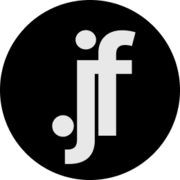
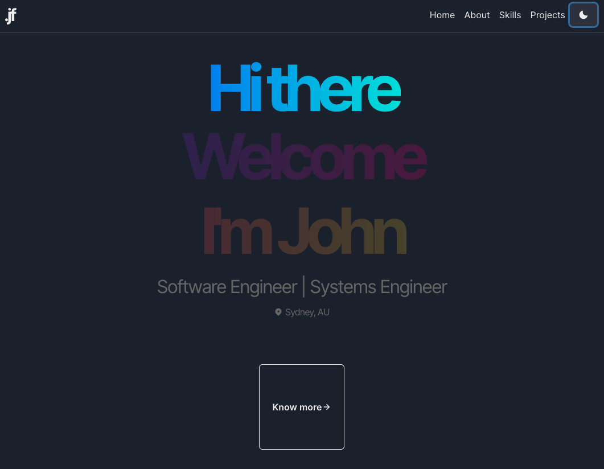

  

<h3 align="center">
  My Portfolio created with NextJS and GraphQL.
</h3>
<h4 align="center">Next.js | Graphql | 
Chakra UI | GraphQL CMS</h4>
<!-- E02041 -->

  
  
  
  
  
  

  <a href="#rocket-technologies">Technologies</a>&nbsp;&nbsp;&nbsp;|&nbsp;&nbsp;&nbsp;
  <a href="#star-features">Features</a>&nbsp;&nbsp;&nbsp;|&nbsp;&nbsp;&nbsp;
  <a href="#construction_worker-installation">Installation</a>&nbsp;&nbsp;&nbsp;|&nbsp;&nbsp;&nbsp;
  <a href="#runner-getting-started">Getting started</a>&nbsp;&nbsp;&nbsp;|&nbsp;&nbsp;&nbsp;
  <a href="#bug-issues">Found a bug? Missing a specific feature?</a>&nbsp;&nbsp;&nbsp;|&nbsp;&nbsp;&nbsp;
  <a href="#tada-contributing">Contributing</a>&nbsp;&nbsp;&nbsp;|&nbsp;&nbsp;&nbsp;
  <a href="#closed_book-license">License</a>

  

#### Production: [Portfolio](https://portfolio-johnfreitasau.vercel.app/) 

# :rocket: Technologies

- [ReactJS](https://reactjs.org/)
- [TypeScript](https://www.typescriptlang.org/)
- [NextJS](https://nextjs.org/) ❤️
- [Chakra UI](https://chakra-ui.com/) 
- [GraphQL](https://graphql.org/)
- [GraphQL Request](https://www.npmjs.com/package/graphql-request)
- [GraphCMS](https://graphcms.com/)
- [Date-fns](https://date-fns.org/)
- [React Icons](https://react-icons.github.io/react-icons/#/)
- [Eslint](https://eslint.org/)
- [Prettier](https://prettier.io/)

# :star: Features

* About section
* Skills section
* Projects section
* Project details Modals

**The API**

This project uses [GraphCMS](https://graphcms.com/) as a Headless CMS, which is a content management system that delivers content as data to any platform or device via API.

The frontend interacts with the API to receive the Porfolio data and create the static pages using NextJS.

**Acessing the GraphCMS API**

Make sure to create an account in GraphCMS and create the model structure to fit the schema "graphql/schema.ts", so you will be able to populate the data on the CMS as you wish and receive the data successfully in GraphQL.

To be able to access the GraphCMS API, you will need to get the API access URL under the Settings menu and populate it on your your .env.local. I have created a .env.local.example file as example.
